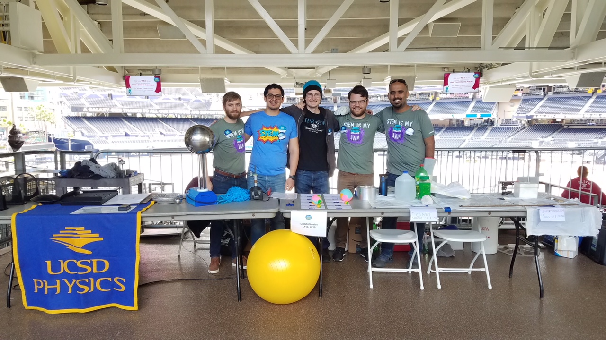
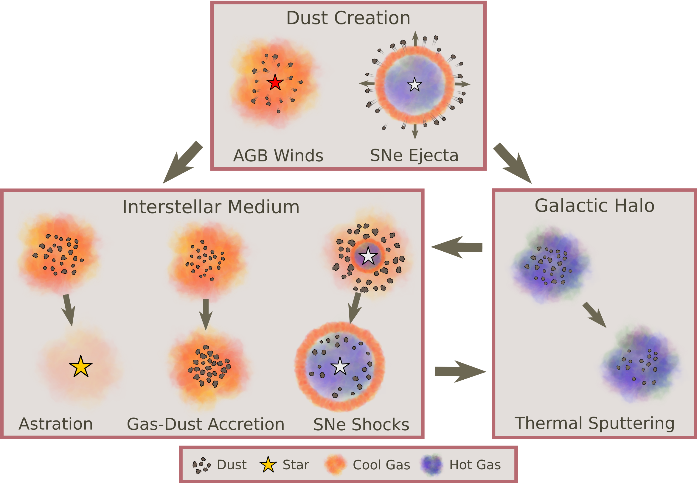

<!--  -->

<h2 class="h1" style="color: {{site.theme_color}}" id="about">About Me </h2>

 I'm Cameron Trapp, a PhD candidate in [Physics](https://physics.ucsd.edu/) and [Astronomy](https://astronomy.ucsd.edu/) at UC San Diego working in collaboration with Prof. [Dušan Kereš](https://cass.ucsd.edu/index.php/faculty:Dkeres). My research is focused on analyzing gas flows onto and through Milky-Way mass galactic disks utilizing cosmological zoom-in simulations as part of the Feedback in Realistic Environments ([FIRE](https://fire.northwestern.edu/)) collaboration. I am currently focused on analyzing various sources of Torque on this accreting gas to understand how it radially transporting to fuel star forming regions in the inner disk. I am also working on creating a suite of synthetic HI observations in order to train a convolutional neural network to aid in interpretation of actual observation and facilitate direct observational comparisons. 

<figure>
    
</figure>

In addition to research, I run the Young Physicists Program ([YPP](https://ypp.ucsd.edu/)), an outreach organization that engages middle and high schoolers in actual physics experiments. Students are able to work directly with a variety of experiments, including mechanics, circuits, radioactive decay, and the infamous egg drop. In addition to managing/soliciting volunteer graduate students and professors, I work directly with the students during experiments and more advanced demonstrations. 

In my spare time I enjoy hiking and camping, as well as designing video games in Unity and Unreal Engine 5.

{: width="500" height="100" loading="lazy"} 

  <ul>
    <li> <a href="https://www.linkedin.com/in/cchoban" title="LinkedIn" class="no-mark-external" target="_blank">  LinkedIn LinkedIn profile</a></li>
    <li> <a href="https://orcid.org/0000-0001-9200-169X" title="Orcid" class="no-mark-external" target="_blank">  Orcid LinkedIn profile</a></li>
    <li> <a href="https://twitter.com/cchoban" title="Twitter" class="no-mark-external" target="_blank">  Twitter Twitter profile</a></li>
    
  </ul>

[{: width="250" height="100" loading="lazy"}](https://fire.northwestern.edu/)

---
<h2 class="h1" style="color: {{site.theme_color}}" id="research">Research </h2>

<h3 class="h2">Radial Flows of Gas</h3>

Brief Description of First Paper.

<!-- Put image and youtube video in a table to make them side by side -->
<table><tr>
<td style="width:50%;background:transparent;border:none;" >
</td>
<td style="width:50%;background:transparent;border:none;">
<iframe width="560" height="315" src="https://www.youtube.com/embed/8bRy5VDJsTI" frameborder="0" allow="encrypted-media;" allowfullscreen></iframe></td>
</tr></table>

Add Text Here

<figure>
    
</figure>

  * **Dust Creation**: The initial seeds' of the dust population are created in the stellar ejecta of SNe and AGB winds where a portion of ejected metals condense into dust. Once these 'seeds' have been created they spend their life in the ISM and/or the galactic halo where they are exposed to various processes. 
  * **Gas-Dust Accretion**: In cool, dense phases of the ISM, gas-phase metals accrete onto the surface of preexisting dust grains growing the grains over time. This is believed to be the main source of dust mass in the MW. 
  * **SNe Shocks**: As supernovae remnants propagate through the ISM they destroy and shatter dust grains residing in the ISM via grain-grain collisions, thermal sputtering, and non-thermal sputtering. This is believed to be the main destroyer of dust in the MW. 
  * **Astration**: As gas cools and collapses forming stars, dust residing in said gas is also destroyed and contributes to the stellar metallicity. 
  * **Thermal Sputtering**: Dust grains residing in hot gas, such as in the galactic halo, are eroded and destroyed by energetic atoms.

<h3 class="h2">Torques and Angular Momentum Transfer</h3>

Description of Torque Project here.

<h3 class="h2">Synthetic Observations and Machine Learning</h3>

Description of CNN Project here.

<!-- <h3 class="h2">Past Projects</h3>
**FILL IN**    
*Advisor: [Adam Burgasser](https://cass.ucsd.edu/index.php/faculty:Aburgasser)*

Description -->

---
<h2 class="h1" style="color: {{site.theme_color}}" id="publications">Publications </h2>

A full list of my publications can be found on ADS [here](https://ui.adsabs.harvard.edu/public-libraries/-Gcrfa83Qq2xs8ndJylF0A).

<!--   
<h3 class="h2">First Author Publications</h3>

<h3 class="h2">Presentations</h3>
 -->
  

---
<h2 class="h1" style="color: {{site.theme_color}}" id="contact">Contact </h2>

Center for Astrophysics and Space Sciences (CASS)   
University of California San Diego   
9500 Gilman Drive   
La Jolla, CA 92093, USA

**ctrap<!-- tyewcnpy -->p [a<!-- juygv -->t] u<!-- tregbijd -->cs<!-- rzyjide --->d [dot] edu**
{:.lead}

