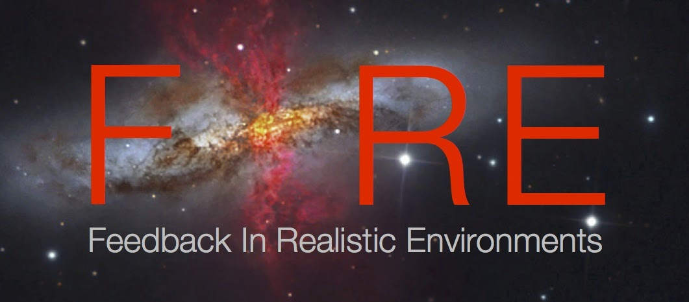
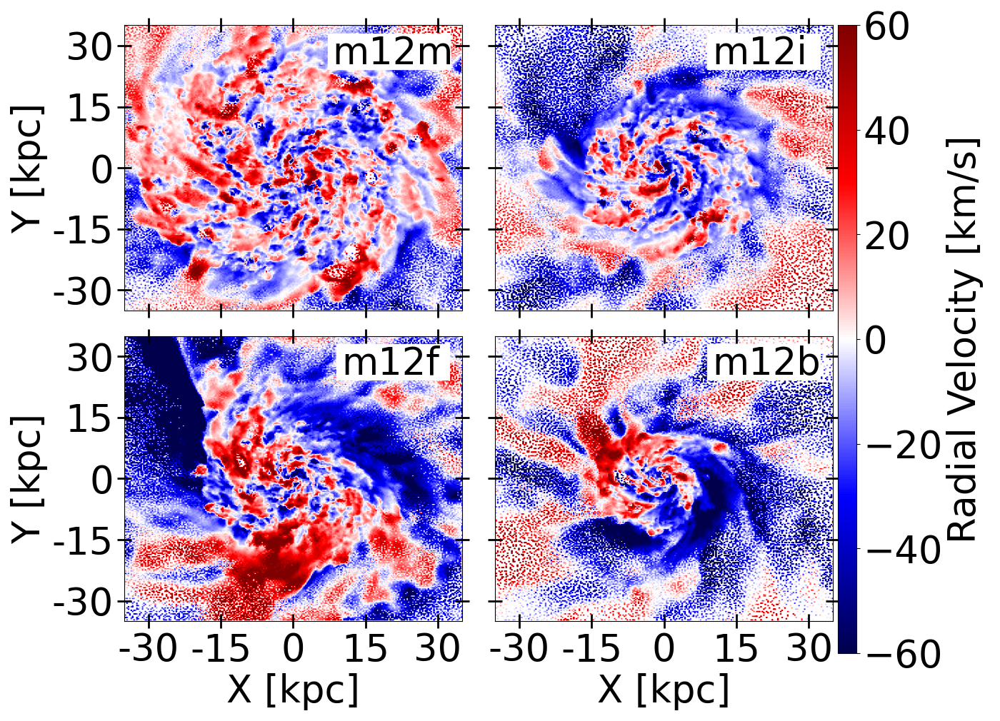
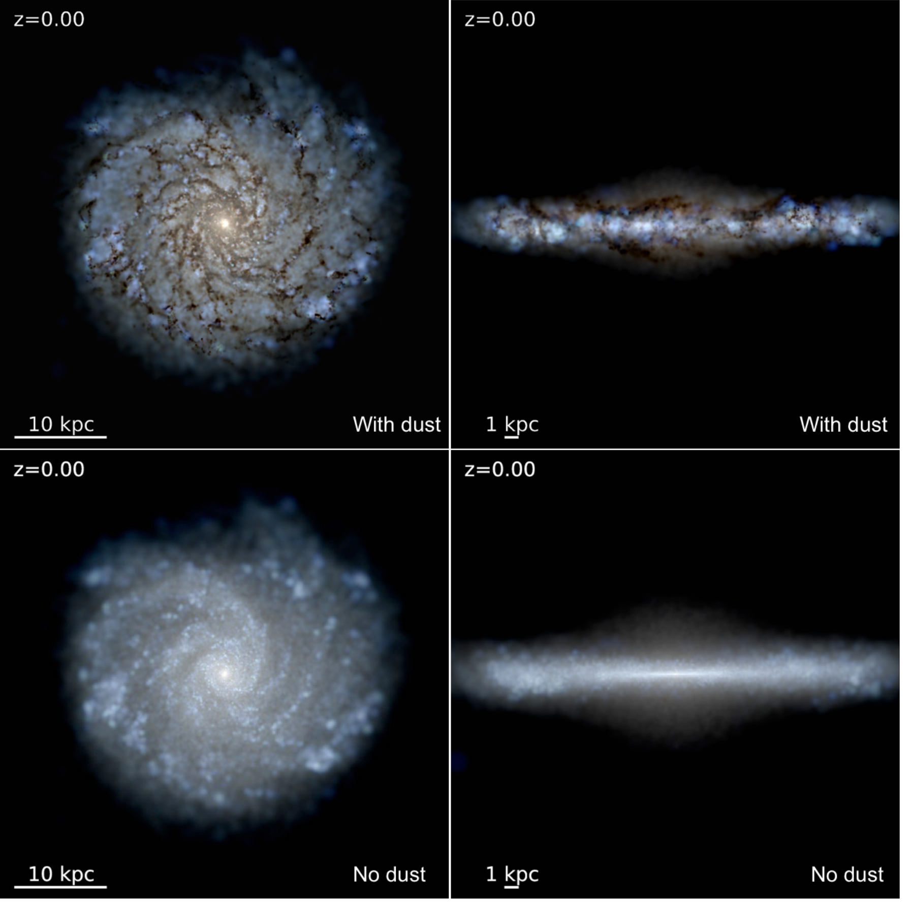
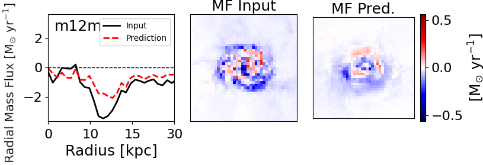

<!--  -->

<h2 class="h1" style="color: {{site.theme_color}}" id="about">About Me </h2>

 I'm Cameron Trapp, a PhD candidate in [Physics](https://physics.ucsd.edu/) and [Astronomy](https://astronomy.ucsd.edu/) at UC San Diego working in collaboration with Prof. [Dušan Kereš](https://cass.ucsd.edu/index.php/faculty:Dkeres). My research is focused on analyzing gas flows onto and through Milky-Way mass galactic disks utilizing cosmological zoom-in simulations as part of the Feedback in Realistic Environments ([FIRE](https://fire.northwestern.edu/)) collaboration. I am currently focused on analyzing various sources of Torque on this accreting gas to understand how it radially transporting to fuel star forming regions in the inner disk. I am also working on creating a suite of synthetic HI observations in order to train a convolutional neural network to aid in interpretation of actual observation and facilitate direct observational comparisons. 

In addition to research, I run the Young Physicists Program ([YPP](https://ypp.ucsd.edu/)), an outreach organization that engages middle and high schoolers in actual physics experiments. Students are able to work directly with a variety of experiments, including mechanics, circuits, radioactive decay, and the infamous egg drop. In addition to managing/soliciting volunteer graduate students and professors, I work directly with the students during experiments and more advanced demonstrations. 

In my spare time I enjoy hiking and camping, as well as designing video games in Unity and Unreal Engine 5.

{: width="500" height="100" loading="lazy"} 

  <ul>
    <li> <a href="https://www.linkedin.com/in/cameron-trapp-89a854120/" title="LinkedIn" class="no-mark-external" target="_blank">  LinkedIn LinkedIn profile</a></li>
    <li> <a href="https://orcid.org/0000-0001-7813-0268" title="Orcid" class="no-mark-external" target="_blank">  Orcid LinkedIn profile</a></li>
    <!--<li> <a href="https://twitter.com/ctrapp" title="Twitter" class="no-mark-external" target="_blank">  Twitter Twitter profile</a></li>    -->

  </ul>

[{: width="250" height="100" loading="lazy"}](https://fire.northwestern.edu/)

---
<h2 class="h1" style="color: {{site.theme_color}}" id="research">Research </h2>

<h3 class="h2">Radial Flows of Gas</h3>

<figure>
    
</figure>

Observations indicate that a continuous supply of gas is needed to maintain observed star formation rates
in large, disky galaxies. To fuel star formation, gas must reach the inner regions of such galaxies. Despite
its crucial importance for galaxy evolution, how and where gas joins galaxies is poorly constrained
observationally and rarely explored in fully cosmological simulations. To investigate gas accretion in the
vicinity of galaxies at low redshift, we analyzed the FIRE-2 cosmological zoom-in simulations for 4 Milky
Way mass galaxies, focusing on simulations with cosmic ray physics. We found that near present times, gas approaches
the disk with angular momentum similar to the gaseous disk edge with an average velocity of 10-20 km/s, piling-up near
the edge and settling into full rotational support. Accreting gas moves predominantly parallel to the disk
and joins largely in the outskirts. Immediately prior to joining the disk, trajectories briefly become more
vertical on average. Within the disk, gas motion is more complex, being dominated by spiral arm induced
oscillations and feedback. However, time and azimuthal averages show slow net radial infall with transport
speeds of 1-3 km/s and net mass fluxes through the disk of M_Solar/yr , comparable to the galaxies' star
formation rates and decreasing towards galactic center as gas is sunk into star formation.

<!-- Put image and youtube video in a table to make them side by side 
<table><tr>
<td style="width:50%;background:transparent;border:none;" >
</td>
<td style="width:50%;background:transparent;border:none;">
<iframe width="560" height="315" src="https://www.youtube.com/embed/8bRy5VDJsTI" frameborder="0" allow="encrypted-media;" allowfullscreen></iframe></td>
</tr></table>
-->

<h3 class="h2">Torques and Angular Momentum Transfer</h3>

A natural follow up to our previous study on how gas moves onto and through Milky-way like galaxies is to investigate the
 physical mechanisms that are driving these flows. To accomplish this, we need to dive into the various sources of torques
 in our simulations to understand where the angular momentum is being transferred to allow this gas to move radially inwards.
 To this effect, we modified the FIRE-2 CR+ code used in our previous study to track and output various sources of torque,
 including gravitational torques, MHD torques associated with the Riemann Solver, torques arising from forces do to radiative transfer,
 as well as torques from the direct momentum injection of stellar feedback, including supernovae and stellar winds. We ultimately found 
 a complex interaction in these gas flows, predominantly governed by the gravitational and hydrodynamical torques, with the torques 
 from supernovae playing an interesting role as well. Ultimately, the hydrodynamical torques serve to transfer angular momentum from
 the outer disk, allowing this gas to move radially inwards and fuel star formation. This angular momentum is either transferred outside of the disk via pressure torques, or to the interior regions of the disk
 via the mass flux terms in the hydro solver. Once in these regions, the dark matter halo and stellar structures are able to more efficiently act as a sink for angular momentum through gravitational torques, allowing for a net inflow of gas in the system.

<h3 class="h2">Synthetic Observations and Machine Learning</h3>

<figure>
    
</figure>

While we find overall consistency of our results and observational constraints, more detailed comparisons are needed to test
the underlying model. Our current directions focus on making synthetic HI observations of our simulated galaxies
for more direct comparisons of how these inflow signatures may observationally manifest and ultimately
aid in the interpretation of observational data. While standard Tilted Ring Models have been used to estimate gas motion
in galaxies for decades, the complex radial velocity structures seen within our galaxies, coupled with the relatively low azimuthally
averaged velocities would prove difficult to fit. To overcome this, we designed a 3-D Convolutional U-Net that reads in the full spectral data cube
of HI observations and outputs a corresponding 2D map of Radial Mass Flux. The neural network has currently been trained on 20 different galaxies from the
core FIRE-2 runs, as well as the CR+ runs. A synthetic image was generated for 10 snapshots for each galaxy, each at 6 different inclinations for a total of 1200 images.
When applied to actual HI data with stable Tilted Ring fits, our network is able to reproduce the radial mass flux curves. Future directions for this project include
adding in additional simulation suites to the training set, so as not to be overly biased towards the types of galaxies in the FIRE simulations, fitting additional
parameters, and fitting 3D spatial maps to visualize observed galaxies.

<!-- <h3 class="h2">Past Projects</h3>
**FILL IN**    
*Advisor: [Adam Burgasser](https://cass.ucsd.edu/index.php/faculty:Aburgasser)*

Description -->

---
<h2 class="h1" style="color: {{site.theme_color}}" id="publications">Publications </h2>

<!-- 
A full list of my publications can be found on ADS [here](https://ui.adsabs.harvard.edu/public-libraries/-Gcrfa83Qq2xs8ndJylF0A).
 -->

  
<h3 class="h2">First Author Publications</h3>
[Gas infall and radial transport in cosmological simulations of Milky Way-mass discs](https://academic.oup.com/mnras/article/509/3/4149/6424962)

[On the detection of high frequency correlations in resting state fMRI](https://www.sciencedirect.com/science/article/abs/pii/S1053811917300824?via%3Dihub)

<h3 class="h2">Additional Publications</h3>
[The impact of cosmic rays on dynamical balance and disc–halo interaction in L-star disc galaxies](https://academic.oup.com/mnras/article/517/1/597/6672585)

[Hot-mode accretion and the physics of thin-disc galaxy formation](https://academic.oup.com/mnras/article/514/4/5056/6608273)

[Real-Time Resting-State Functional Magnetic Resonance Imaging Using Averaged Sliding Windows with Partial Correlations and Regression of Confounding Signals](https://www.liebertpub.com/doi/10.1089/brain.2020.0758)

<!-- 
<h3 class="h2">Presentations</h3>
 -->
  

---
<h2 class="h1" style="color: {{site.theme_color}}" id="contact">Contact </h2>

Center for Astrophysics and Space Sciences (CASS)   
University of California San Diego   
9500 Gilman Drive   
La Jolla, CA 92093, USA

**ctrap<!-- tyewcnpy -->p [a<!-- juygv -->t] u<!-- tregbijd -->cs<!-- rzyjide --->d [dot] edu**
{:.lead}

